<h1 align="center">Gym Pro Fitness</h1>

[View the live project here](https://gym-pro-fitness-d84818eee5ff.herokuapp.com/)

## Table of Contents
  * [Table of Contents](#table-of-contents)
  * [Introduction](#introduction)
  * [User Stories](#user-stories)
  * [UX](#ux)
    + [Typography](#typography)
    + [Wireframes](#wireframes)
  * [Accessibility](#accessibility)
  * [Database Design](#database-design)
  * [Features](#features)
  * [Existing Features](#existing-features)
  * [Future Features](#features-features)
  * [Issues and Bugs](#issues-and-bugs)
  * [Technologies Used](#technologies-used)
  * [Testing](#testing)
  * [Deployment](#deployment)
    + [Local Deployment](#local-deployment)
    + [Heroku Deployment](#heroku-deployment)
  * [Credits](#credits)
    + [Content](#content)
    + [Media](#media)

## Introduction
Welcome to GYM PRO FITNESS. The website is designed to empower users on their fitness journey, they can plan, track, and achieve their fitness goals. Whether you're a seasoned gym-goer, a home workout enthusiast, or just starting your fitness journey, our website has something for everyone. Navigating GYM PRO FITNESS is a breeze! Intuitive and user-friendly interface ensures that you can focus on your workouts without the distraction of a complex interface. Create and manage personalized workout routines tailored to your fitness goals, discover new workout routines. Join us in unlocking your full potential, breaking barriers, and achieving fitness milestones. Your journey begins here with GYM PRO FITNESS! 

 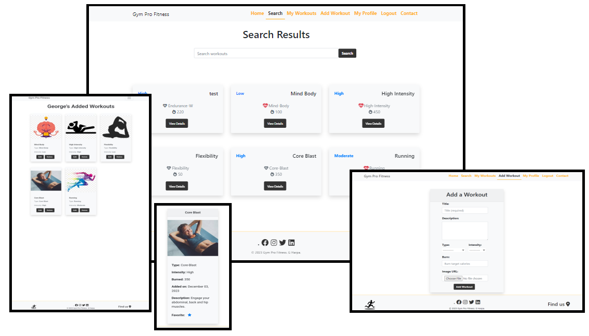

## User Stories

1. As a fitness enthusiast, I want to create an account on the “Gym Pro Fitness” platform, so I can log in using my username or email and password.
2. As a registered user, I want the ability to update my profile information, including changing my password.
3. As a user committed to my fitness journey, I want the option to delete my user profile if I decide to discontinue using the “Gym Pro Fitness” platform.
4. As a fitness enthusiast, I want to add a new workout to the platform.
5. As a registered user, I want to update the details of the workouts I’ve added, allowing corrections to information such as exercise names and descriptions.
6. As a registered user, I want to delete workout details from my profile, removing them from the platform.
7. As a registered user, I want to see a list of all the workouts I’ve added to the “Gym Pro Fitness” platform for easy reference.
8. As a fitness enthusiast and a registered user, I want to search for specific workouts on the platform, so I can discover new exercises added by all users.
9. As a registered/no registere user, I want to use a contact form to reach out to the “Gym Pro Fitness” administrators with any questions, feedback, or concerns.

###### [Back to top ⇧](#table-of-contents)

## UX

### I.Development Planes
#### Strategy

- **Objective:** Create a user-friendly platform that empowers fitness enthusiasts to achieve their health and fitness goals by providing comprehensive workout routines.

- **User Research:** Conduct in-depth research to understand the needs, preferences, and challenges of fitness enthusiasts.

- **Competitor Analysis:** Analyze existing fitness platforms to identify strengths, weaknesses, opportunities, and threats. Learn from successful platforms and identify areas for differentiation.

- **Goals:** 
  - Provide an intuitive and engaging user interface.
  - Supportive community where users can share their fitness routines.

#### Target Audience
- **Roles:** 
  - Fitness Enthusiasts: Individuals passionate about achieving their fitness goals.
  - Gym Instructors: Professionals looking for effective workout routines to share with clients.

- **Demographics:** 
  - Age: 18-45
  - Gender: All
  - Occupation: Varied
  - Fitness Level: Beginner to Advanced

- **Psychographics:** 
  - Enjoys a mix of workout styles.

- **Personality & Attitudes:** 
  - Energetic, Motivated, Positive

- **Values:** 
  - Health, Progress, Community

- **Lifestyles:** 
  - Busy Professionals, Fitness Enthusiasts, Health-Conscious Individuals

#### User and Client Needs
  - 
    | User Needs                            | Client Needs                               |
    |---------------------------------------|--------------------------------------------|
    | Register/Login to account             | User account management system             |
    | Search for workouts                   | Efficient workout search functionality     |
    | View/Edit/Delete Details of a workout | Detailed workout information presentation  |
    | Get in Contact with Admin             | Responsive customer support                |

#### Importance and Viability Table

  - 
    | Feature                  | Importance (1-5) | Viability (1-5) |
    |--------------------------|------------------|-----------------|
    | Home Page                | 5                | 5               |
    | Login                    | 5                | 5               |
    | Register                 | 5                | 5               |
    | User Profile             | 5                | 4               |
    | - Edit Profile           | 3                | 4               |
    | - Delete Profile         | 3                | 3               |
    | My Workouts              | 5                | 5               |
    | - Add Workout            | 5                | 5               |
    | - View Workouts          | 4                | 5               |
    | - Edit Workout           | 3                | 4               |
    | - Delete Workout         | 3                | 3               |
    | Search Page              | 4                | 3               |
    | Contact Page             | 4                | 4               |
    | - Send Message           | 5                | 4               |

### II.Information Architecture

The application is structured into the following main sections:

1. **Home:** Landing page.
2. **Workouts:** Search for various workouts.
3. **Profile:** User-specific information, settings, and added workouts.
4. **Contact:** Form to get in touch with the administrators.

### III.Scope

#### Features:
1. **User Authentication:**
   - Register and log in with username or email.
   - Edit profile information, change password.
   - Delete user profile.

2. **Workout Management:**
   - Add a new workout to the database.
   - Update workout details (e.g.:title, type, intensity, descriptions).
   - Delete workout details.

3. **Interaction:**
   - View a list of added workouts.
   - Search for workouts.

4. **Contact Form:**
   - Users can reach out to administrators with questions, feedback, or concerns.

#### User Flow:

1. **New User:**
   - Registers for an account.
   - Logs in using username or email.
   - Uses the contact form to communicate with administrators.

2. **Registered User:**
   - Edits profile information, changes password
   - Adds a new workout to the database.
   - Updates or deletes workout details.
   - Views a list of added workouts.
   - Searches for workouts.
   - Uses the contact form to communicate with administrators.

#### Technical Requirements:
- **Front-End:**
  - HTML, CSS, JavaScript.
  - Bootstrap for responsive design.
  - Font Awesome for icons.

- **Back-End:**
  - Python.
  - Django framework.

- **Database:**
  - PostgreSQL.

- **Deployment:**
  - Hosted on Heroku.
  - Static files stored on Cloudinary.
  - Database hosted on ElephantSQL.

- **Version Control:**
  - Git and GitHub.

#### Milestones:
1. **Setup and Basic Structure:**
   - Initialize Django project.
   - Create necessary models and views.
   - Implement basic front-end structure.

2. **User Authentication and Profiles:**
   - Implement user registration and login.
   - Create and edit user profiles.

3. **Workout Management:**
   - Develop functionality to add, update, and delete workouts.

4. **Interaction Features:**
   - Implement views for user-added workouts.

5. **Additional Features:**
   - Add search functionality.

6. **Contact Form:**
   - Create a form for user-admin communication.

7. **Deployment and Testing:**
   - Host on Heroku.
   - Test functionality and resolve issues.

###### [Back to top ⇧](#table-of-contents)

## Accessibility
### Lighthouse Audit
###### go to [Testing Lighthouse section](TESTING.md#lighthouse-validation)
This project has undergone a comprehensive Lighthouse audit, resulting in good scores across key metrics:

- **Performance:** The application loads quickly and responds swiftly, providing users with a seamless experience.

- **Accessibility:** The application is accessible to users of all abilities.

- **Best Practices:** The codebase adheres to industry best practices, promoting maintainability and stability.

- **SEO (Search Engine Optimization):** The application is optimized for search engines, enhancing discoverability.

###### [Back to top ⇧](#table-of-contents)

## Surface

##### SKELETON
- **Wireframes:** [Link to Wireframes](TESTING.md#Wireframes)

##### Colour Scheme
- The color palette used in the website:
  - Primary Color: #333333;
  - Secundary Color: #FFD700.
  - Accent Color: #4169E1.
  - Background Color: #F8F9FA.
  - Text Color: #000000, #FFFFFF.

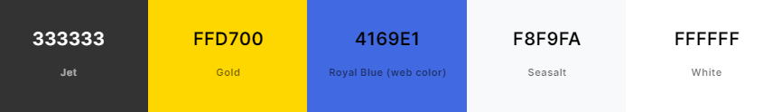

## Database Design
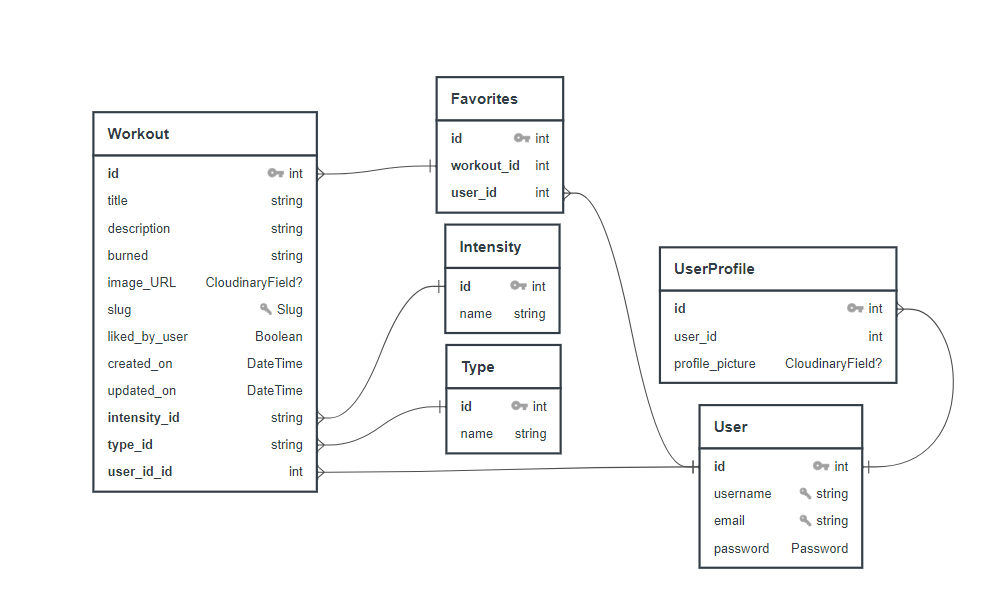
### User Profile Model
  - represents additional information associated with a user's profile.
-   __Attributes:__
    - **user:** One-to-One relationship with the User model.
    - **profile_picture:** CloudinaryField for storing the profile picture.

### Type Model
  - represents different types/categories that can be assigned to workouts.
-   __Attributes:__
    - **name:** CharField representing the name of the type.

### Intensity Model
  - represents different intensity levels that can be assigned to workouts.
-   __Attributes:__
    - **name:** CharField representing the name of the intensity.

### Workout Model
  - represents individual workout entries.
-   __Attributes:__
    - **title:** CharField representing the title of the workout.
    - **type:** ForeignKey relationship with the Type model.
    - **description:** TextField for a detailed description of the workout.
    - **intensity:** ForeignKey relationship with the Intensity model.
    - **burned:** CharField representing the calories burned during the workout.
    - **image_url:** CloudinaryField for storing an image associated with the workout.
    - **slug:** SlugField for creating human-readable URLs.
    - **user_id:** ForeignKey relationship with the built-in User model.
    - **likes:** Many-to-Many relationship with the User model for tracking likes.
    - **liked_by_user:** BooleanField indicating whether the current user has liked the workout.
    - **created_on:** DateTimeField indicating the creation timestamp.
    - **updated_on:** DateTimeField indicating the last update timestamp.
-   __Meta:__
    - **ordering:** Specifies the default ordering based on the creation timestamp.

###### [Back to top ⇧](#table-of-contents)

## Features

### Existing Features

-   __Navbar__
    - The navbar provides a navigation menu for users to easily access different sections of the application. It includes links to the homepage, user profile, workout-related features, and other relevant pages.

-   __Footer__
    - The footer is located at the bottom of the webpage and contains the logo, the social media and a link to the contact page. It provides a consistent location for secondary navigation.
    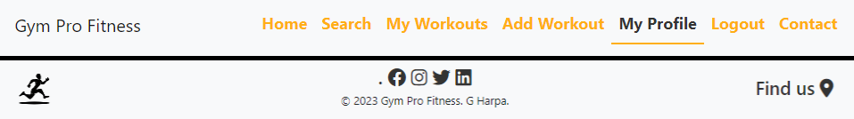

-   __Homepage__
    - The homepage serves as the landing page for my application. A Gif was added on the background of the title. Was set it with css and Bootstrap.
    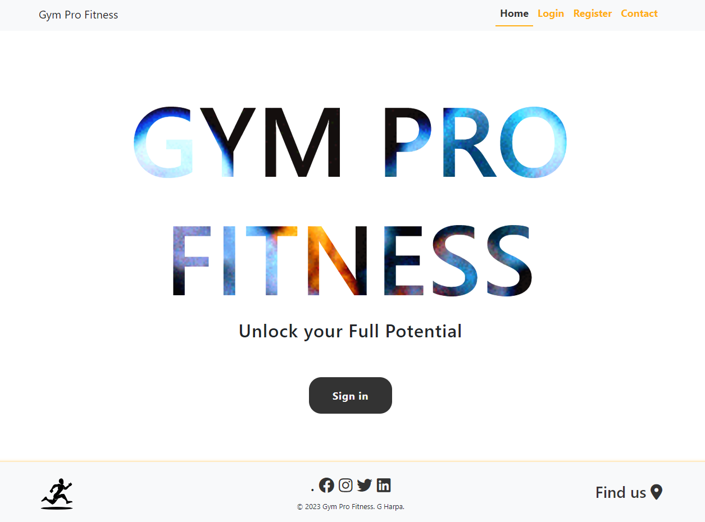

-   __Login/Registration Pages:__
    - The login page allows existing users to log in by entering their credentials (username/email and password). The registration page enables new users to create an account by providing necessary information, such as username, email, and password. The forms has validation check for different case of errors (e.g.: 'User already exist', 'Your password must to contains...', 'Your passwords didn't match', 'Email is not have the correct form')
    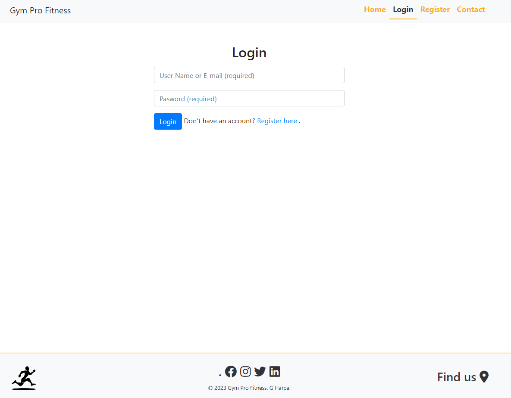
    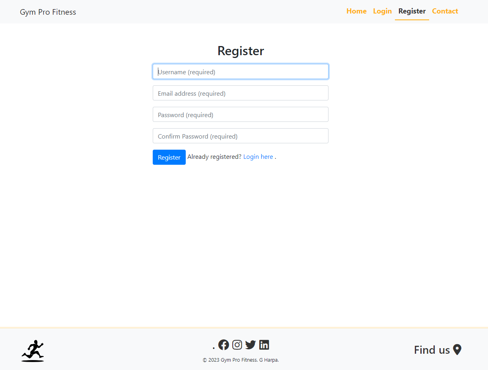

-   __Contact Page:__
    - The contact page allows users to reach out to the platform administrators. Includes a form with fields for name, email, and message, allowing users to submit inquiries or feedback. If the user is authenticated the email will fill in automatically.
    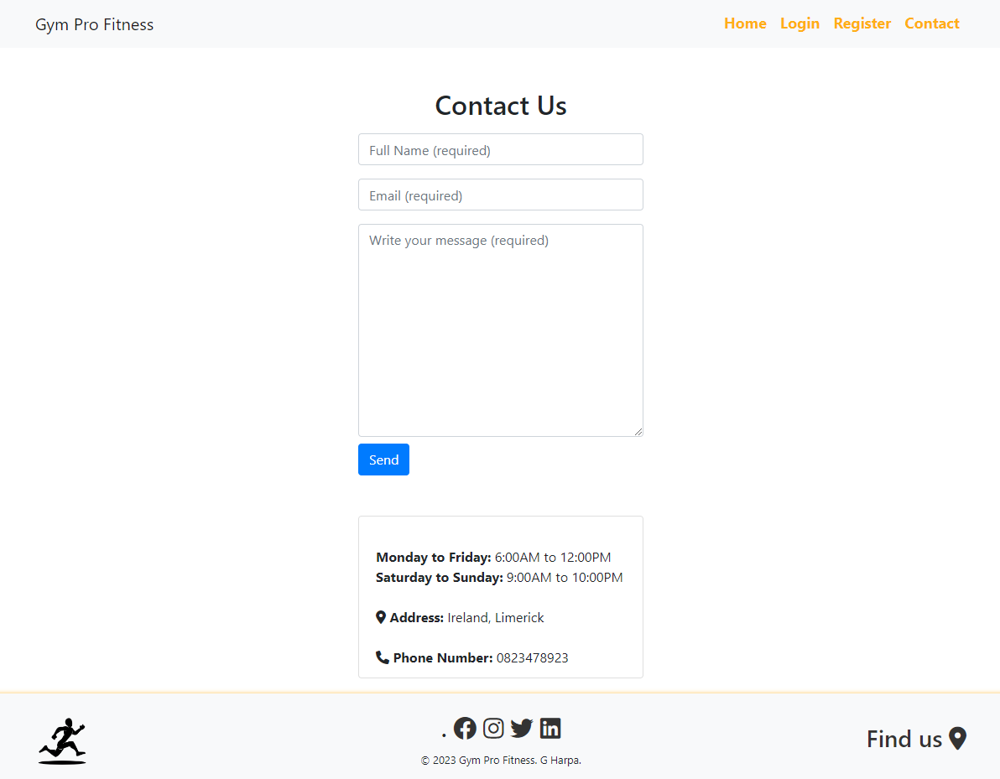

-   __View Details of a Workout:__
    - This feature allows users to view detailed information about a specific workout. Include the workout title, description, type, intensity, calories burned, and image if exist. Users can access this information by clicking on a workout from the list or search results or clicking the title of the workout from 'My Workouts' page. The favorite field, will help the user to see in the Search list page the workouts that he liked.
    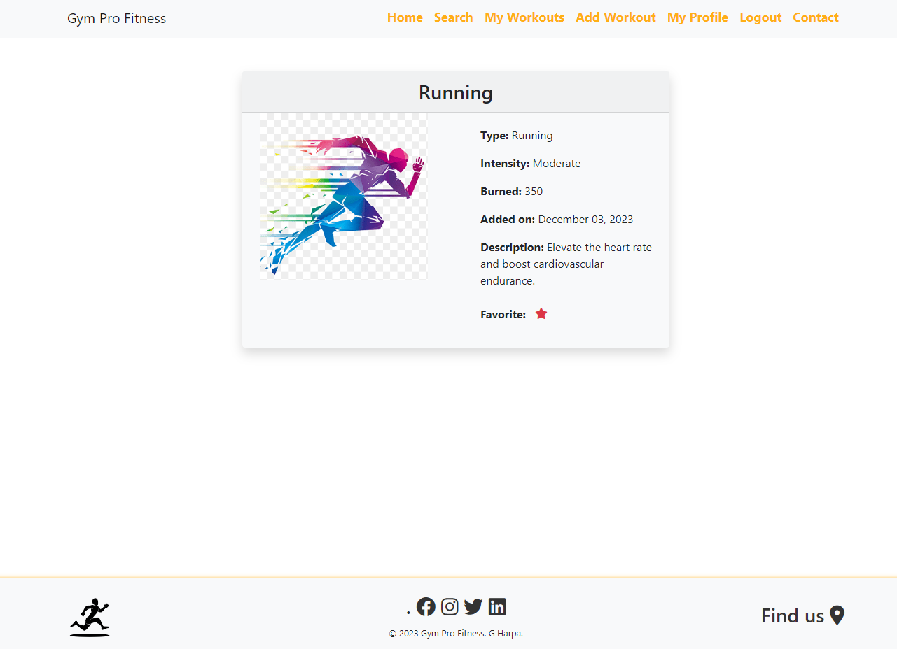

-   __My Workouts:__
    - The "My Workouts" page displays a list of workouts created by the logged-in user. It provides a personalized view, allowing users to manage and interact with their own workouts. 
    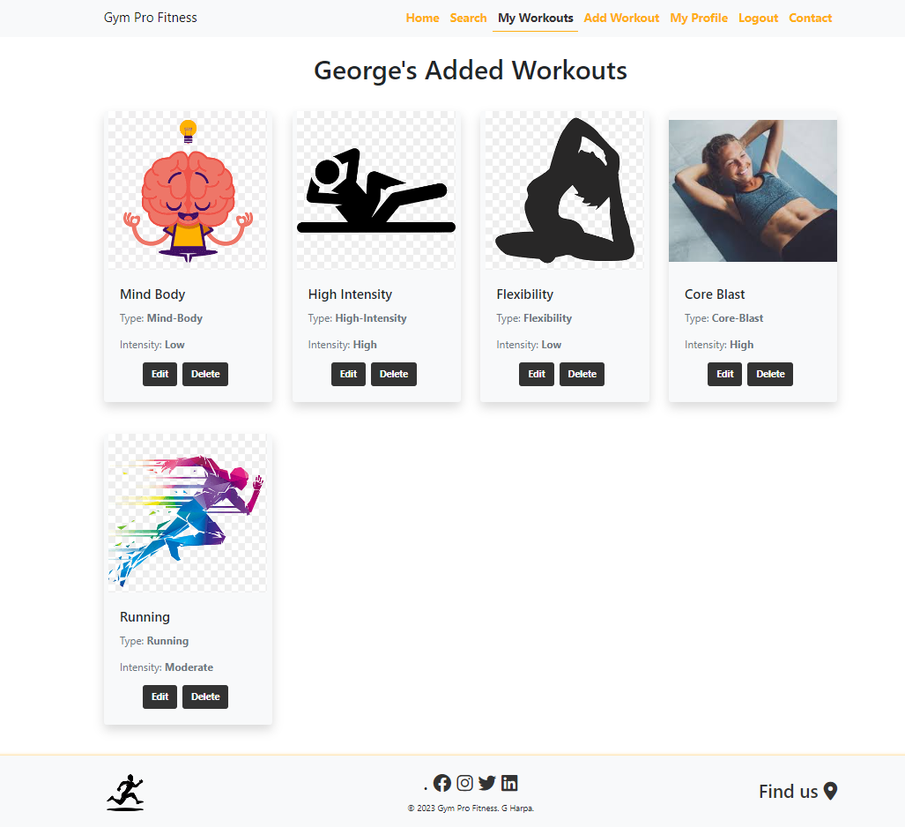

-   __Edit Workout:__
    - Users can edit the details of a workout they created. The "Edit Workout" feature provides a form pre-filled with the existing details, allowing users to make modifications and update the workout.
    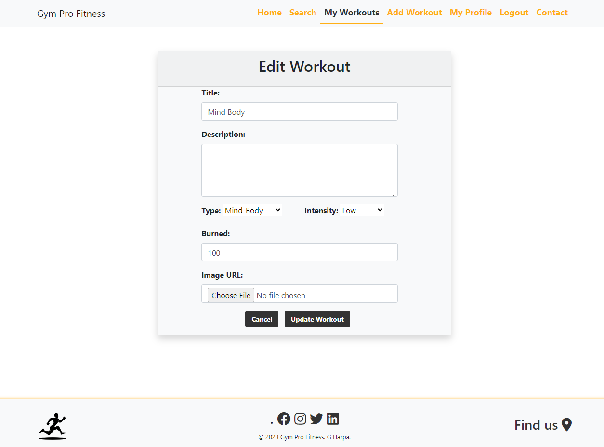

-   __Delete Workout:__
    - The "Delete Workout" feature allows users to remove a workout they created. This action is irreversible, user will be asked to confirm the deletion with the posiblility to cancel the action of deletion.
    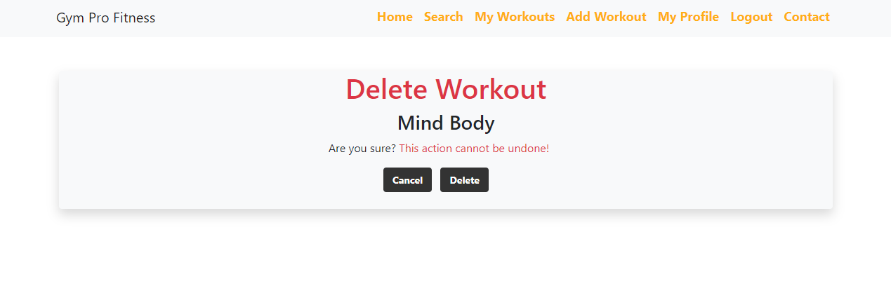

-   __Search Workout:__
    - The "Search Workout" feature allows users to search a workout after title, intensity or type. The workout are displayed based on date of creation. In the search list, the user can see the workout that he liked. The liked workout will have a red beat hart. The likes are based on the user, even if you can see the workouts of another user, you will not see what he liked.
    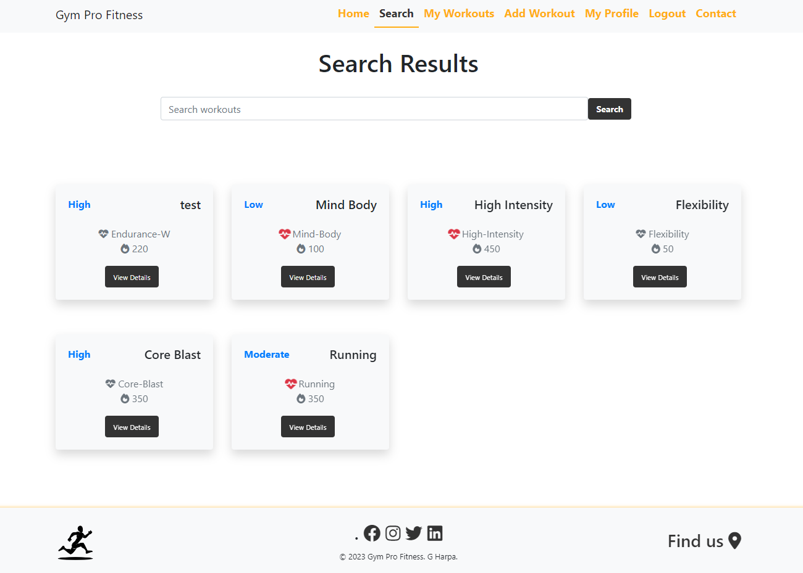

-   __Profile Page:__
    - The profile page showcases information about the user, including their username and email and 2 buttons, one for edit and one for delete.
    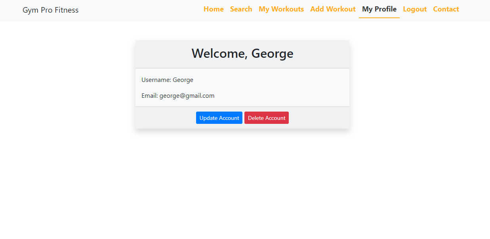

-   __Edit Profile Page:__
    - Users can modify their profile information page. This includes updating the username, email, and password.
    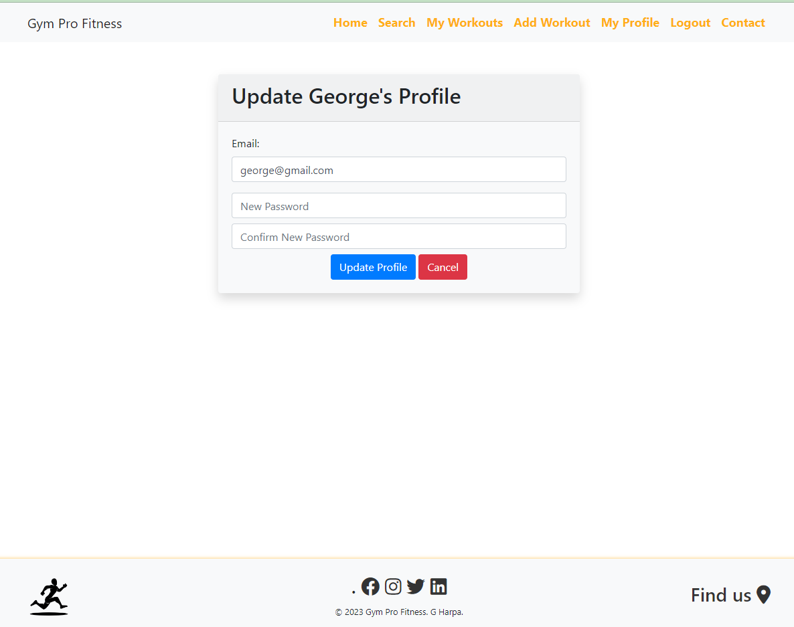

-   __Delete Profile Page:__
    - The "Delete Profile" feature allows users to permanently delete their account. User will be required to confirm the decision, as this action is irreversible.
    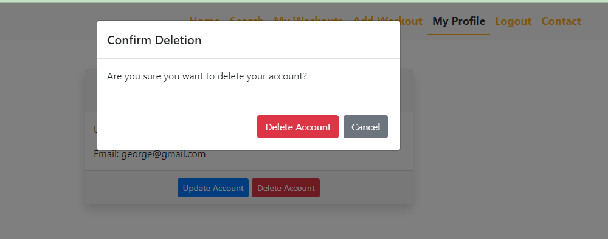

###### [Back to top ⇧](#table-of-contents)

### Future Features

-   __User Ratings and Reviews:__
    - Enable users to rate and leave reviews for workouts. This can provide valuable feedback for both workout creators and users looking for high-quality content.

-   __Workout Challenges:__
    - Implement a feature that allows users to create or participate in workout challenges. Users can set goals, track progress, and compete with others.

-   __Notification System:__
    - Notification system to alert users about new comments, likes. Notifications keep users engaged and informed.

-   __Advanced User Roles:__
    - Introduce the roles "Admin" and  "Trainer" with specific permissions. Admins can manage the platform, while trainers may have the ability to curate and recommend workouts.

###### [Back to top ⇧](#table-of-contents)

## Issues and Bugs
- **Can't login with email**
  - On the request I have called the wrong variable.

###### [Back to top ⇧](#table-of-contents)

## Technologies Used

- [HTML5](https://en.wikipedia.org/wiki/HTML5) used for templates
- [CSS3](https://en.wikipedia.org/wiki/CSS) used for style
- [JavaScript](https://en.wikipedia.org/wiki/JavaScript) used for interactivity
- [Python](https://en.wikipedia.org/wiki/Python_(programming_language)) used to develop the backend

- [Bootstrap](https://getbootstrap.com/) used to simplify the style process.
- [Font Awesome](https://fontawesome.com/) used for icons.

- [Django](https://www.djangoproject.com/) used for backend
- [PostgreSQL](https://www.postgresql.org/) used to create the database
- [ElephantSQL](https://www.elephantsql.com/) used to host the databse
- [Cloudinary](https://cloudinary.com/) used to store images
- [Summernote](https://summernote.org/) used to create a rich text editor for the website.
- [gunicorn](https://pypi.org/project/gunicorn/) used to run the website on Heroku.
- [dj_database_url](https://pypi.org/project/dj-database-url/) used to connect database on Heroku.
- [psycopg2](https://pypi.org/project/psycopg2/) used to connect database on Heroku
- [python-dotenv](https://pypi.org/project/python-dotenv/) used to hide sensitive information.

###### [Back to top ⇧](#table-of-contents)

## Testing
For Testing details go to [TESTING.md](TESTING.md)

### User Tests

### User Authentication Tests

| Test Case | Description |
| --- | --- |
| User Registration | Test user registration with valid credentials. Ensure a user is created in the database. |
| User Login | Test user login with valid credentials. Ensure the user is logged in. |
| Protected View | Test access to a protected view without authentication. Ensure the user is redirected to the login page. |

### Profile Tests

| Test Case | Description |
| --- | --- |
| Update Profile | Test updating user profile information. Ensure changes are saved in the database. |
| Change Password | Test changing the user password. Ensure the password is updated in the database. |

### Workouts Tests

| Test Case | Description |
| --- | --- |
| Add Workout | Test adding a workout through the form. Ensure the workout is saved in the database. |
| View Workout | Test viewing a workout. Ensure the workout has the same details as it is in the database |
| Edit Workout | Test editing an existing workout. Ensure changes are reflected in the database. |
| Delete Workout | Test deleting a workout. Ensure the workout is removed from the database. |

### Navigation and Menu Tests

| Test Case | Description |
| --- | --- |
| Navigate through the Menu | Test navigating through different sections of the application's menu. Ensure the navigation works as expected. |

###### [Back to top ⇧](#table-of-contents)

## Deployment

- This project was developed using [CodeAnyWhere](https://codeanywhere.com/).
- I have used the terminal to commit changes in my GitHub repository.
- In the GitHub I have created User Stories and Epics, the commits are related to them based on the id that gitHub generated for each issue that was created.

### Prepare before Deploy
1. Create an `.env` file in your project, at root level.
2. Add in this file your secret keys.
3. Run `pip3 install -r requirements.txt` to install needed packages.
4. Run `python3 manage.py migrate` to migrate your DB models.
5. Run `python3 manage.py createsuperuser` to create a superuser.
6. Run `python3 manage.py runserver` to start the server.

### Deploying on Heroku Pages
To deploy this web app to Heroku Pages from GitHub repository, the following steps were taken:

1. Log into [GitHub](https://github.com/login "Link to GitHub login page") or [create an account](https://github.com/join "Link to GitHub create account page").
2. Locate the [GitHub Repository](https://github.com/GeorgeH23/gym-pro-fitness "Link to GitHub Repo").
3. Create an account on [Heroku:](https://dashboard.heroku.com/apps).
4. Create a new Heroku app.
5. Set the BuilPacks and the Config Vars.
6. Link the Heroku app to the git hub repository.
7. Click on Deploy.

###### [Back to top ⇧](#table-of-contents)

## Credits

### Content 
- The ReadME file was inspired from my first project [Travel Addict](https://github.com/GeorgeH23/travel-addict/blob/main/README.md) and [Books4Life](https://github.com/tomdu3/books4life/)
- All other content was written by the developer

###### [Back to top ⇧](#table-of-contents)