# Testing
Testing section of the [README.md](README.md) file.

Return to [README.md](README.md)

## Table of Contents

[Testing](#testing)
[Table of Contents](#table-of-contents)
+ [Testing User Stories](#testing-user-stories)
+ [Manual Testing](#manual-testing)
+ [Automated Testing](#automated-testing) 
    - [Code Validation](#code-validation)
    - [Lighthouse Validation](#lighthouse-validation)
+ [Wireframes](#wireframes)

###### [Back to top ⇧](#table-of-contents)

## User Stories Testing

#### 1. User Registration
- As a ***fitness enthusiast***, I want to ***create an account on the “Gym Pro Fitness” platform***, so I can ***log in using my username or email and password***.
    - A new user can successfully register on the platform.
    - The registration form includes fields for username, email, and password.
    - The user can log in using the registered username or email and password.

#### 2. Profile Information Update
- As a ***registered user***, I want ***the ability to update my profile information, including changing my password***.
    - A registered user can access a profile settings page.
    - The profile settings page includes options to update information such as name and password.
    - Changes made in the profile settings are reflected in the user's profile.

#### 3. User Profile Deletion
- As a ***user committed to my fitness journey*** and a ***registered user***, I want ***the option to delete my user profile***, so ***if I decide to discontinue using the “Gym Pro Fitness” platform***.
    - A registered user can navigate to the profile deletion page.
    - Confirmation is required before the profile is permanently deleted.

#### 4. Add a New Workout
- As a ***fitness enthusiast*** and a ***registered user***, I want to ***add a new workout to the platform***.
    - Users can access the "Add Workout" section.
    - The "Add Workout" form includes fields for title, type, description, intensity, image and burne target calories.

#### 5. Update Workout
- As a ***registered user***, I want to ***update the details of the workouts I’ve added***, so that will ***allowing corrections to information***.
    - Registered users can access the "Edit Workout" page.
    - The "Edit Workout" page allows modification of workout details.
    - Changes made are reflected in all the screens where the workout is present.

#### 6. Delete Workout
- As a ***registered user*** and a ***registered user***, I want to ***delete a workout from my profile***, so that ***will removing them from the platform***.
    - Users can access the "Delete Workout" page.
    - Confirmation is required before a workout is permanently deleted.

#### 7. View User's Added Workouts
- As a ***registered user*** and a ***registered user***, I want to ***see a list of all the workouts I’ve added to the “Gym Pro Fitness” platform***, for easy reference.
    - A user can access a page displaying a list of all workouts they have added.
    - The list includes details such as workout title, type, intensity and image.

#### 8. Search for Workouts
- As a ***fitness enthusiast*** and a ***registered user***, I want to ***search for specific workouts on the platform***, so I can ***discover new exercises added by all users***.
    - Users can access a search feature on the platform.
    - The search allows users to discover workouts added by all users.
    - Search results are relevant and display workout details.

#### 9. Contact Form Submission
- As a ***registered/no registere user***, I want to ***use a contact form***, so that ***I will to reach out to the “Gym Pro Fitness” administrators with any questions, feedback, or concerns***.
    - Users, whether registered or not, can access a contact form.
    - The contact form includes fields for name, email and message.
    - Submitted forms are sent to the platform administrators.

###### [Back to top ⇧](#table-of-contents)

## Manual Testing

| Test Case | Description | Expected Result | Steps to Reproduce |
| --- | --- | --- | --- |
| **1** | **User Registration** | Ensure users can register successfully. | 1. Navigate to the registration page. 2. Fill in the required details, otherwise an error will occur. 3. Submit the form. | 
| **2** | **User Login** | Verify that registered users can log in. | 1. Go to the login page. 2. Enter valid credentials, otherwise an error will occur. 3. Log in. |
| **3** | **Add a Workout** | Test the process of adding a new workout. | 1. Access the "Add Workout" section. 2. Fill in the workout details, otherwise an error will occur. 3. Submit the form. |
| **4** | **View Workout Details** | Check if users can view detailed information about a workout. | 1. Visit the workout details page. 2. Confirm all details are displayed correctly. |
| **5** | **Edit Workout** | Test the ability to edit an existing workout. | 1. Navigate to the "Edit Workout" page. 2. Modify workout details. 3. Save changes. |
| **6** | **Delete Workout** | Ensure users can delete a workout. | 1. Go to the "Delete Workout" confirmation page. 2. Confirm deletion. |
| **7** | **Delete Account** | Ensure users can delete his profile. | 1. Go to the "My Profile" page. 2. Choose "Delete Account" 3. Confirm deletion. |

###### [Back to top ⇧](#table-of-contents)

## Automated Testing
### Code Validation

#### HTML Validation Results:
[W3C Markup Validator](https://validator.w3.org/) used to validate the `HTML`.

- Homepage
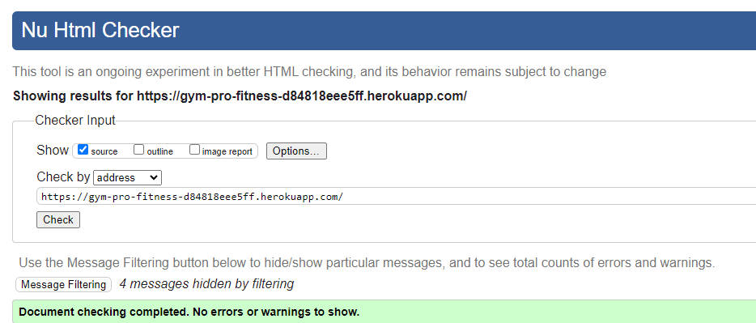

- Contact
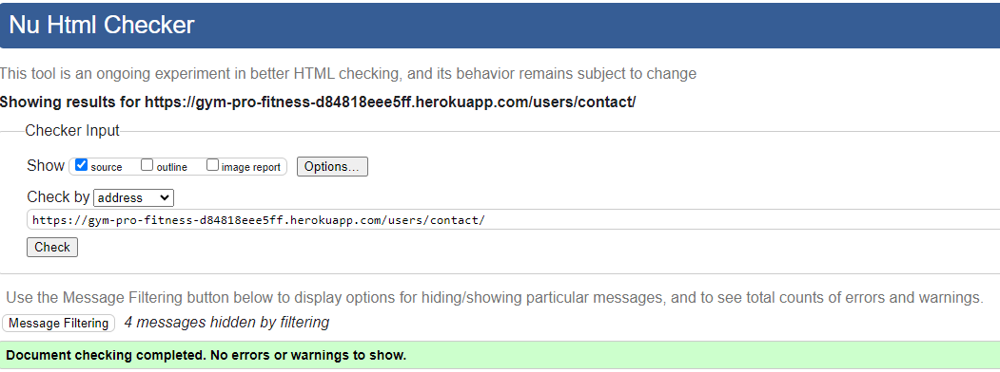

- Login
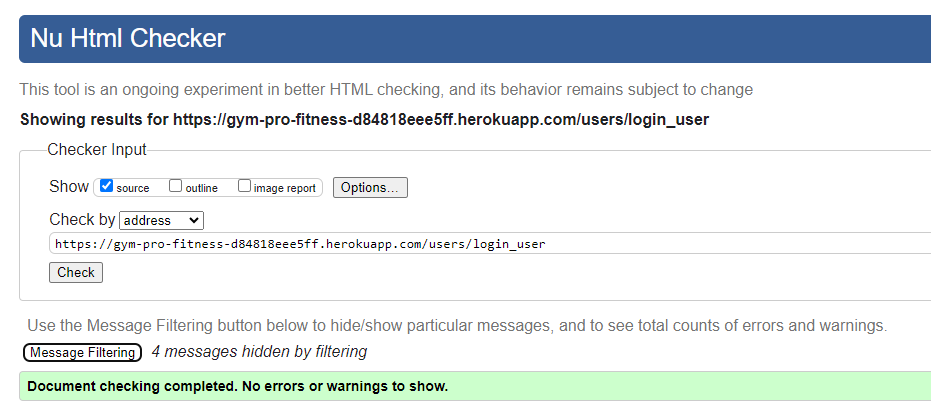

- Register
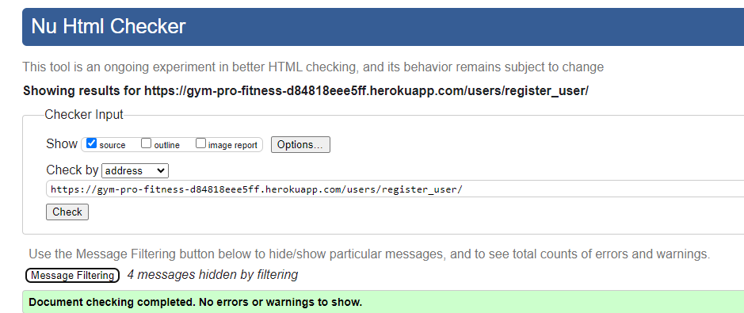

- Profile
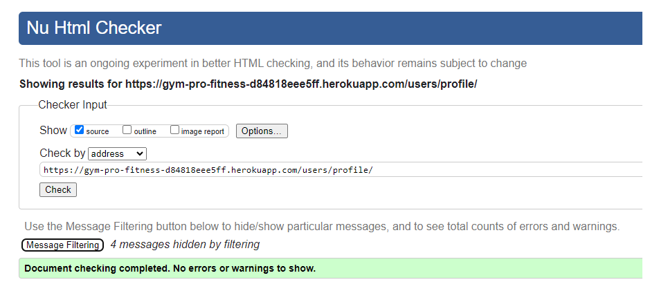

- Profile Update

- Workouts

- Workout Add
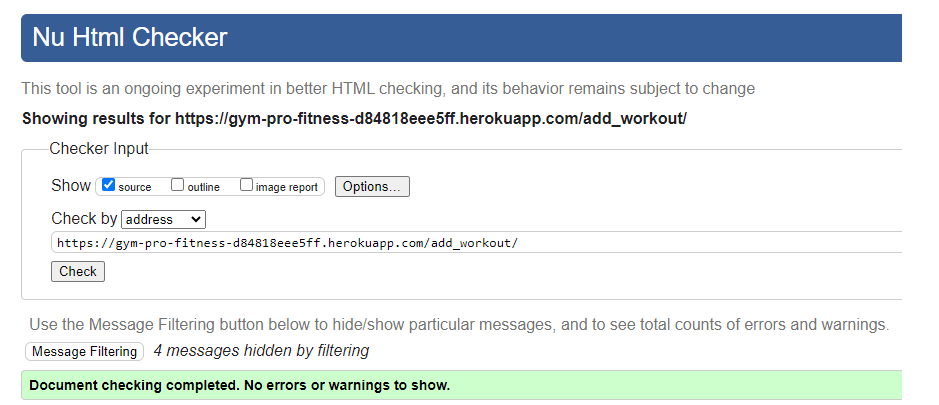

- Workout Edit
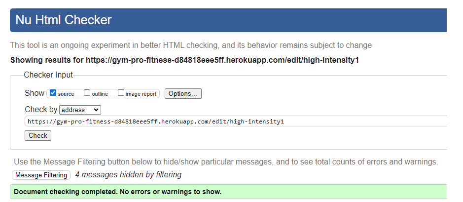

- Workout View
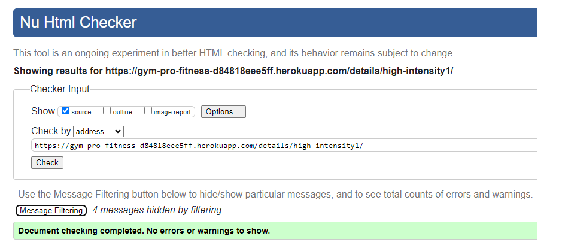

- Workout Delete
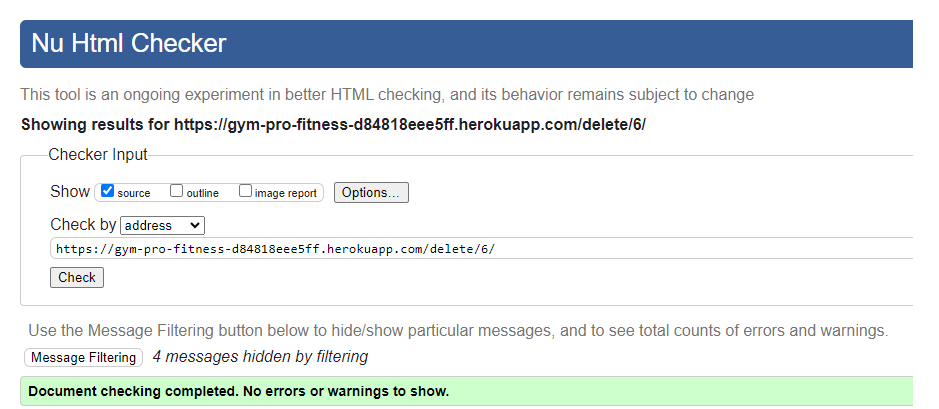

- Workout Search
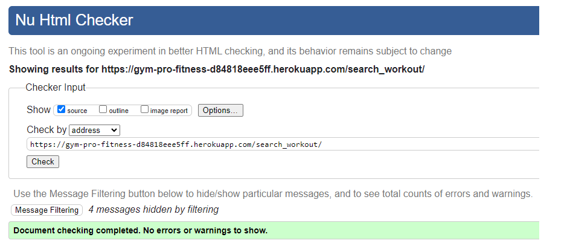

###### [Back to top ⇧](#table-of-contents)

#### CSS Validation Results:
[CSS Validation Service](https://jigsaw.w3.org/css-validator/) used to validate the `CSS`.

- css file

#### JS Validation Results:
[JSHint JavaScript Code Quality Tool](https://jshint.com/) used to validate the `JS`.

- js file
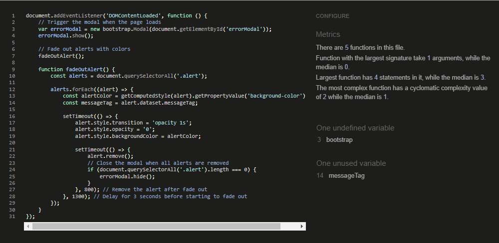

#### PYTHON Validation Results:
[CI PEP8 online validator](https://pep8ci.herokuapp.com/) used to validate the `PYTHON`.

- View file from Accounts
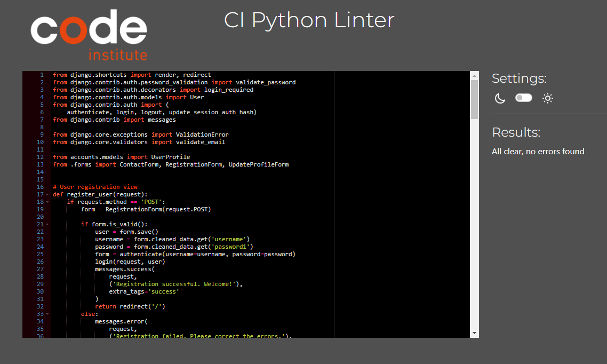

- View file from Workouts
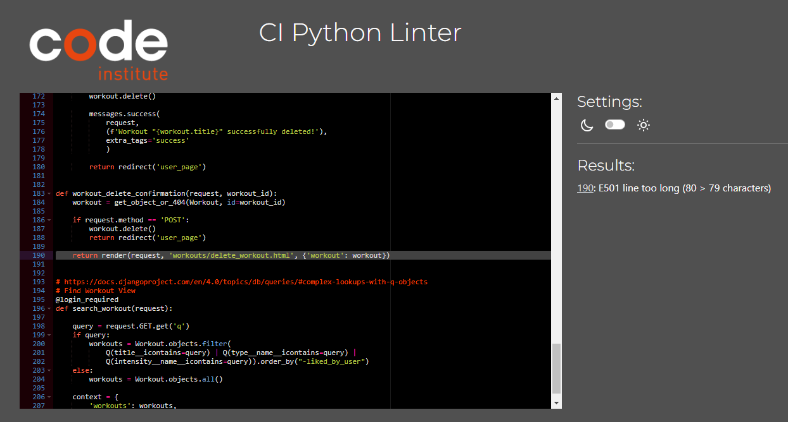

###### [Back to top ⇧](#table-of-contents)

### Lighthouse Validation
#### Results:
[Lighthouse](https://developers.google.com/web/tools/lighthouse) used to measure the performance of the website.

- Homepage
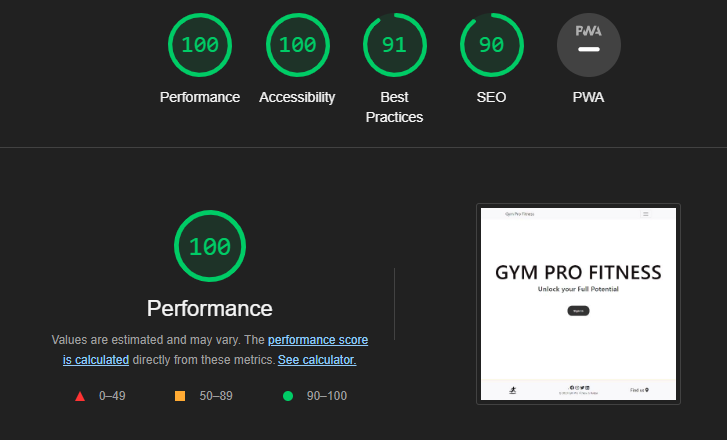

- Contact
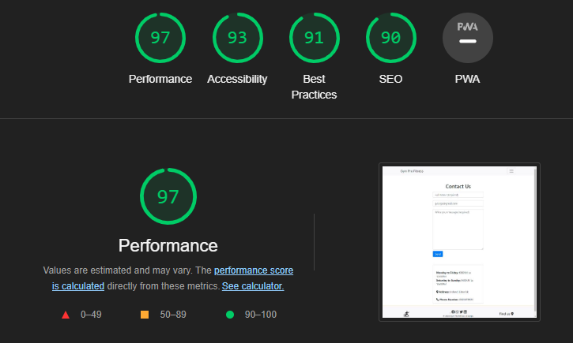

- Login
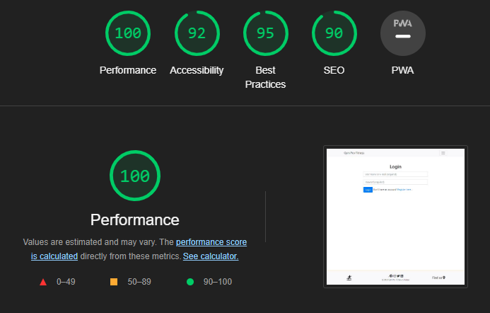

- Register
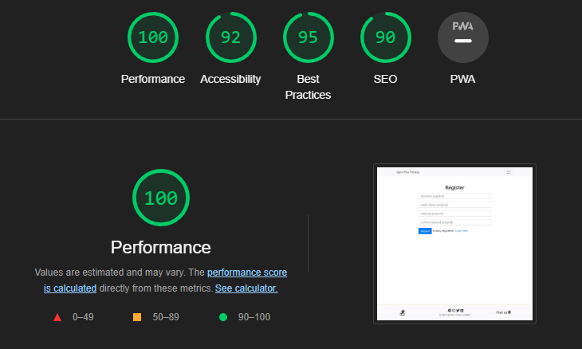

- Profile
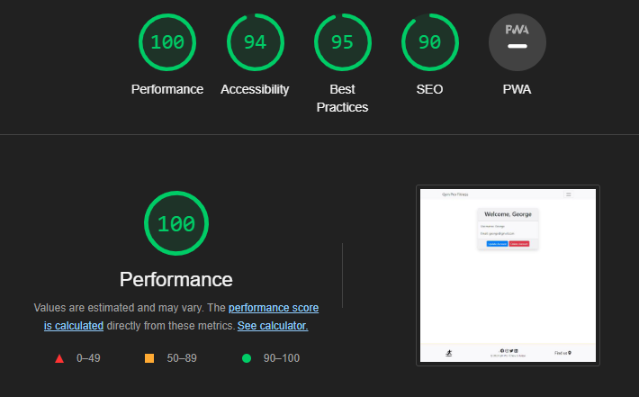

- Workouts
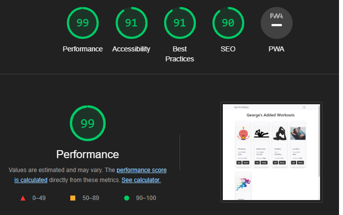

- Workout Add
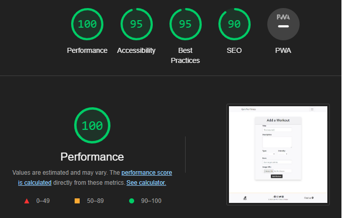

- Workout Edit

- Workout View
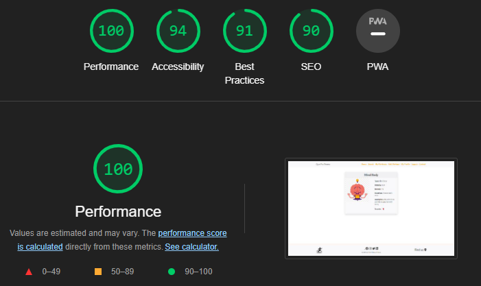

- Workout Search
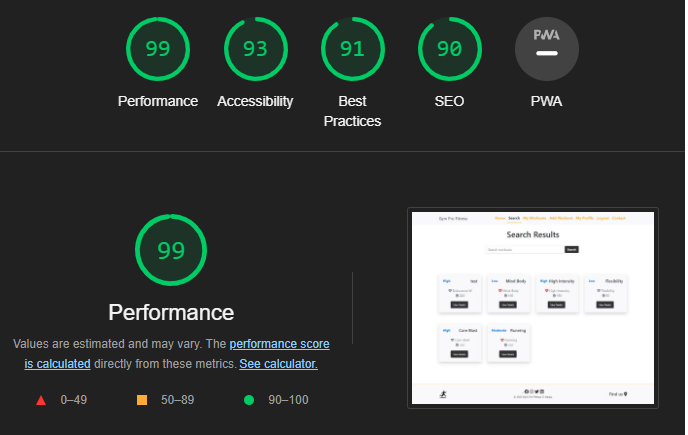

###### [Back to top ⇧](#table-of-contents)

### Wireframes

- Login and Contact Wireframes
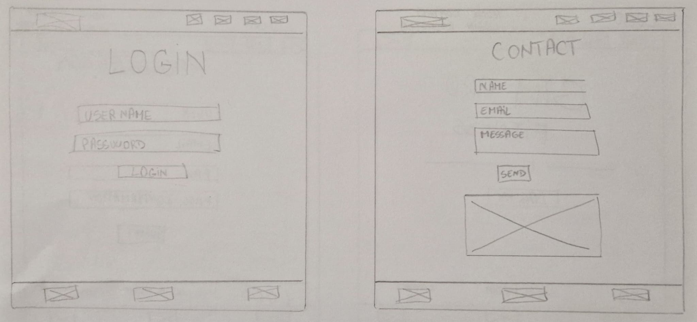

- Registration and Home Wireframes
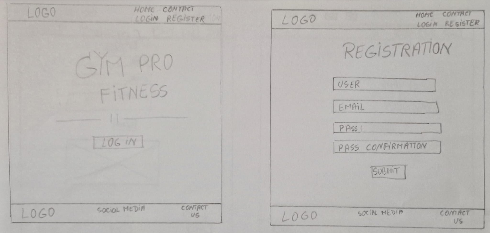

- Add Workout and Workouts list Wireframes
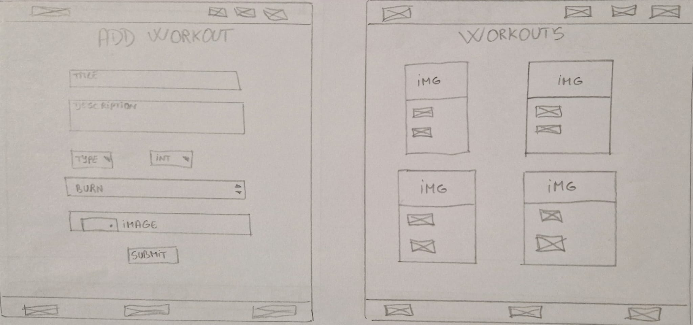

- Workout Search and View Wireframes
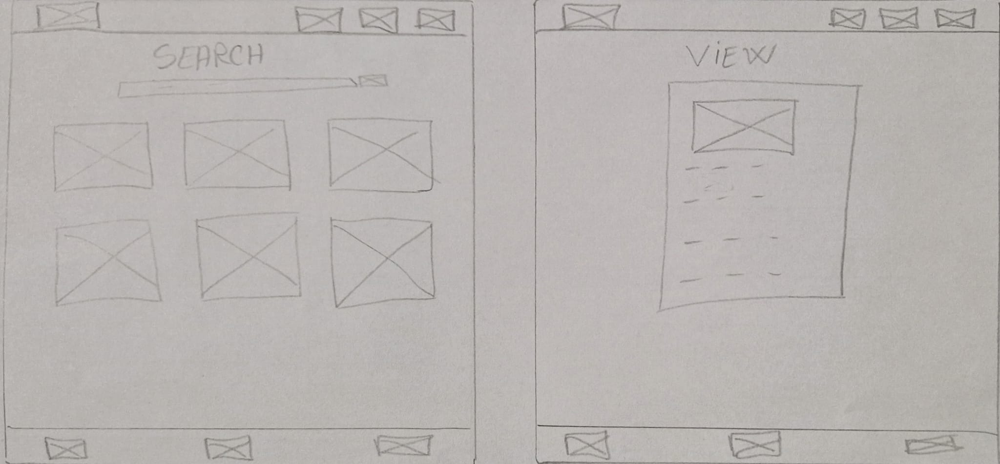

###### [Back to top ⇧](#table-of-contents)