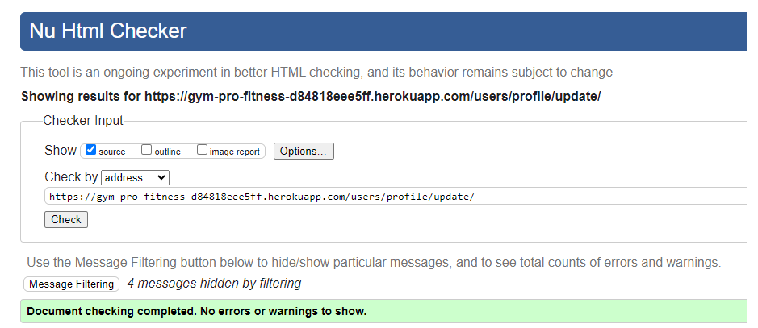
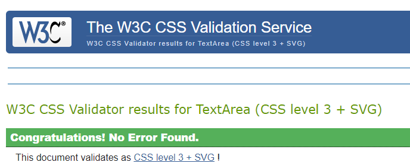

# Testing
Testing section of the [README.md](README.md) file.

Return to [README.md](README.md)

## Table of Contents

[Testing](#testing)
[Table of Contents](#table-of-contents)
+ [Testing User Stories](#testing-user-stories)
+ [Manual Testing](#manual-testing)
+ [Automated Testing](#automated-testing) 
    - [Code Validation](#code-validation)
    - [Lighthouse Validation](#lighthouse-validation)
    - [Browser Validation](#browser-validation)

[Back to top ⇧](#table-of-contents)

## Automated Testing
### Code Validation

#### HTML Validation Results:
[W3C Markup Validator](https://validator.w3.org/) used to validate the `HTML`.

- Homepage

- Contact

- Login

- Register

- Profile

- Profile Update

- Workouts

- Workout Add

- Workout Edit

- Workout View

- Workout Delete

- Workout Search

#### CSS Validation Results:
[CSS Validation Service](https://jigsaw.w3.org/css-validator/) used to validate the `CSS`.

- css file

#### JS Validation Results:
[JSHint JavaScript Code Quality Tool](https://jshint.com/) used to validate the `JS`.

- js file

#### PYTHON Validation Results:
[CI PEP8 online validator](https://pep8ci.herokuapp.com/) used to validate the `PYTHON`.

- View file from Accounts

- View file from Workouts

#### Lighthouse Validation Results:
[Lighthouse](https://developers.google.com/web/tools/lighthouse) used to measure the performance of the website.

- Homepage

- Contact

- Login

- Register

- Profile

- Workouts

- Workout Add

- Workout Edit

- Workout View

- Workout Search
